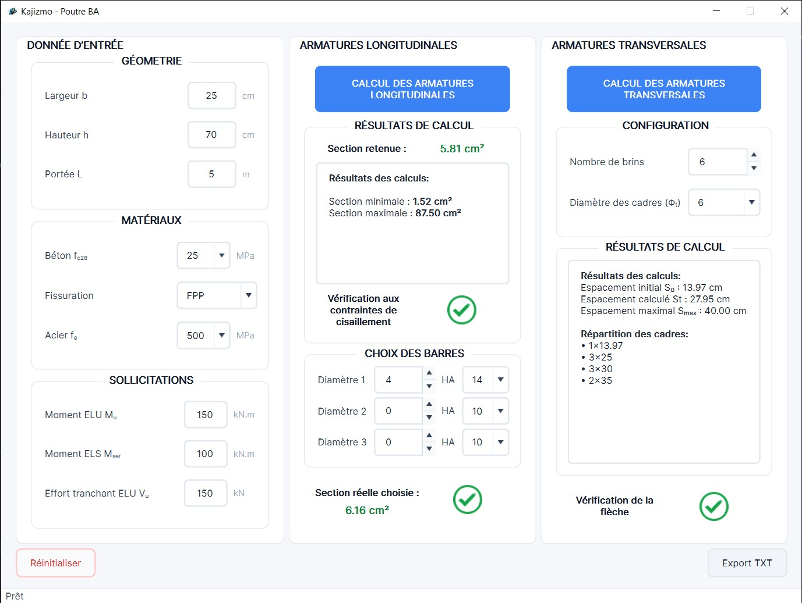

# Kajizmo — Poutre BA

> Application de bureau en **Python / PySide6** pour le dimensionnement de poutres en béton armé selon le **BAEL 91 révisé 99**.

<p align="center">
  
</p>

## Objectif

Kajizmo centralise les calculs de dimensionnement d’une poutre BA dans une interface simple :

- armatures longitudinales,
- vérification du cisaillement,
- vérification simplifiée de la flèche,
- armatures transversales,
- comparaison entre section théorique et section réelle,
- export d’une note de calcul texte.

L’application automatise les vérifications réglementaires, mais ne remplace pas le contrôle d’un ingénieur.

## Règles de calcul

Le moteur applique des vérifications issues du BAEL 91 mod. 99 avec les hypothèses suivantes :

- **Longitudinal**
  - calcul à l’**ELU** et à l’**ELS**,
  - section retenue = enveloppe la plus défavorable entre ELU, ELS et section minimale,
  - prise en compte des cas de flexion simple ou double selon les sollicitations.

- **Cisaillement**
  - comparaison de `tau_u` à `tau_lim`,
  - la limite dépend de la classe de fissuration choisie.

- **Flèche**
  - vérification simplifiée d’une poutre simplement appuyée,
  - comparaison entre la flèche calculée et la limite de service.

- **Transversal**
  - calcul de l’espacement initial `St0`, courant `St` et maximal `Stmax`,
  - répartition des cadres selon la logique de l’outil, avec séquence de type Caquot lorsque possible.

## Saisie attendue

Unités utilisées dans l’interface :

- `b`, `h` : cm
- `L` : m
- `Mu`, `Mser` : kN·m
- `Vu` : kN
- `fc28` : MPa
- `fe` : MPa

Les classes de fissuration disponibles influencent les contraintes admissibles à l’ELS.

## Comment utiliser l’application

1. Renseigner la géométrie de la poutre :
   - largeur `b`,
   - hauteur `h`,
   - portée `L`.
2. Choisir les matériaux :
   - béton `fc28`,
   - acier `fe`,
   - classe de fissuration.
3. Saisir les sollicitations :
   - moment ultime `Mu`,
   - moment de service `Mser`,
   - effort tranchant `Vu`.
4. Cliquer sur **Calcul des armatures longitudinales**.
5. Lire la section théorique, la vérification du cisaillement et la vérification de la flèche.
6. Saisir une composition réelle d’armatures pour comparer la section réelle à la section théorique.
7. Définir le nombre de brins et le diamètre des cadres.
8. Cliquer sur **Calcul des armatures transversales**.
9. Utiliser **Export TXT** pour générer une note de calcul.
10. Utiliser **Réinitialiser** pour repartir d’une saisie vierge.

## Fonctionnalités

- interface graphique PySide6 chargée depuis un fichier `.ui`,
- architecture claire en couches `controllers` / `models` / `views`,
- validation des champs de saisie,
- retours visuels dans l’interface,
- journalisation dans `kajizmo.log`,
- export texte de la note de calcul,
- packaging compatible PyInstaller.

## Lancer l’application

```bash
python -m venv .venv
.venv\Scripts\activate
pip install -r requirements.txt
python main.py
```

## Tester le moteur

```bash
python test_engine.py
```

Ce script instancie une poutre type et affiche les résultats de calcul en console.

## Fichiers utiles

- `main.py` : point d’entrée de l’application
- `src/controllers/main_controller.py` : orchestration des actions utilisateur
- `src/controllers/calculation_coordinator.py` : coordination des calculs métier
- `src/models/engine.py` : modèle central `Poutre`
- `src/models/longitudinal.py` : calcul des armatures longitudinales
- `src/models/cisaillement.py` : vérification du cisaillement
- `src/models/fleche.py` : vérification de la flèche
- `src/models/transversal.py` : calcul des armatures transversales
- `src/views/main_view.py` : chargement et gestion de l’interface

## Logs

Les journaux applicatifs sont écrits dans :

- `kajizmo.log`

## Packaging

Fichiers PyInstaller disponibles :

- `main.spec`
- `kajizmo - Poutre.spec`

## Licence

Projet sous licence MIT. Voir `LICENSE`.
